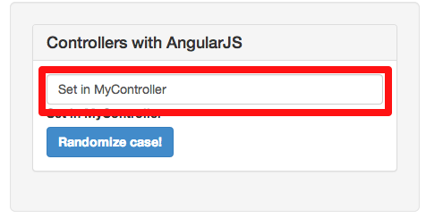
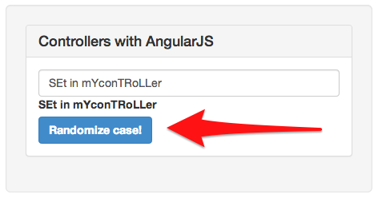
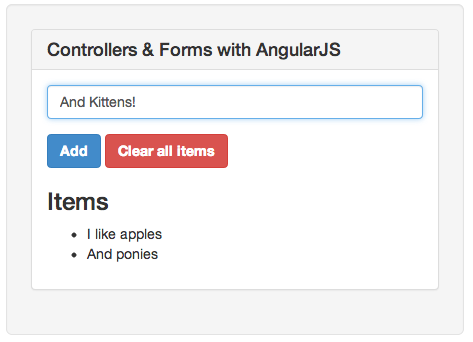
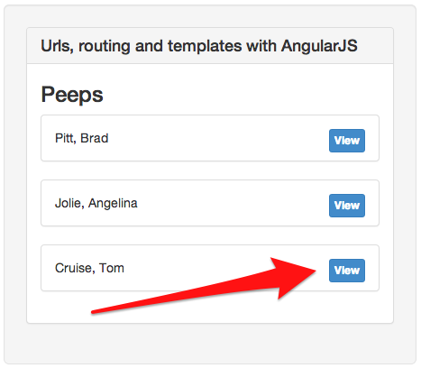
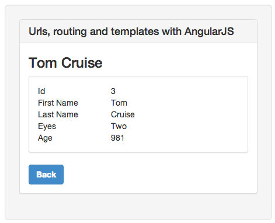

!SLIDE
# Controllers #
Business logic is defined in controllers in the MVC sense.

Controllers respond to events and can be stateful.

!SLIDE smbullets
# Benefits #
* Behavior is divorced from the DOM
* No setting up callbacks
* No watching the DOM for changes

!SLIDE code
cd controllers\_basic\_forms

!SLIDE
# Initialize variables #

!SLIDE smaller
    @@@ html
    

      <input type='text' ng-model="important_information">
      <label>
        {{important_information}}
      </label>
    

!SLIDE smaller
    @@@ javascript
    function MyController($scope){
      $scope.important_information = 'Set in MyController';
    }

!SLIDE center

!SLIDE
# Respond to click event #

!SLIDE smaller
    @@@ html
    

      <button ng-click='randomizeCase()'>
        Randomize case!
      </button>
    

!SLIDE smaller
    @@@ javascript
    function MyController($scope){
      $scope.important_information = 'Set in MyController';

      $scope.randomizeCase = function(){
        var array = $scope.important_information.split('');

        for(var i=0; i < array.length; i ++){
          if(Math.round(Math.random()) == 1)
            array[i].toUpperCase();
          else
            array[i].toLowerCase();
        };

        $scope.important_information = array.join('');
      }
    }

!SLIDE center

!SLIDE
# Submitting forms #

!SLIDE smaller
    @@@ html
    

      <form ng-submit='addItem()'>
        <input type="text" ng-model="itemText">

        <button>Add</button>

        <button ng-click='clearItems()' form='#'>
          Clear all items
        </button>
      </form>

      <ul>
        <li ng-repeat='item in items'>
          {{item.text}}
        </li>
      </ul>
    

!SLIDE smaller
    @@@ javascript
    function MyController($scope){
      $scope.items = [
        {text: 'Initialized in the controller'},
        {text: 'Also Initialized in the controller'}
      ];

      $scope.addItem = function(){
        $scope.items.push({text: $scope.itemText});
        $scope.itemText = '';
      };

      $scope.clearItems = function(){
        $scope.itemText = '';
        $scope.items = [];
      }
    }

!SLIDE center

!SLIDE
# Urls, routing and templates #

!SLIDE code
cd controllers_routing

!SLIDE smaller
    @@@ javascript
    var app = angular.module('MyApp', []);

    app.config(function($routeProvider, $locationProvider){
      $locationProvider.html5Mode(true);
      $routeProvider.
        when("/index.html", {
          templateUrl: '/templates/index.html',
          controller: 'IndexController'
        }).
        when("/show/:id.html", {
          templateUrl: '/templates/show.html',
          controller: 'ShowController'
        }).
        otherwise({redirectTo: '/index.html'})
    });

!SLIDE smaller
## index.html ##
    @@@ html
    <body ng-app='MyApp'>
      <ng-view>
      </ng-view>

      
    </body>

!SLIDE smaller
## templates/show.html
    @@@ html
    <h3>{{person.firstName + ' ' + person.lastName}}</h3>

    
 Id:         {{person.id}}        

    
 First name: {{person.firstName}} 

    
 Last name:  {{person.lastName}}  

    ...

    <button ng-click='back()'>Back</button>

!SLIDE smaller
    @@@ javascript
    app.controller("IndexController",
        function($scope, $location, Person) {

      $scope.people = Person.all();
    });

    app.controller("ShowController",
        function($scope, $routeParams, $window, Person) {

      $scope.person = Person.find($routeParams.id);

      $scope.back = function(){
        $window.history.back();
      };
    });

!SLIDE center
## index.html ##

!SLIDE center
## show.html ##
