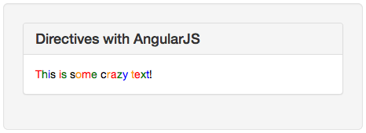

!SLIDE
# Directives #
Extend the behavior of HTML

!SLIDE
## Creating new element ##

!SLIDE smaller
    @@@html
    <body ng-app="MyApp">
      <crazy-panel>
        This is some crazy text!
      </crazy-panel>
    </body>

!SLIDE center

!SLIDE smaller
    @@@javascript
    var app = angular.module("MyApp", []);

    app.directive('crazyPanel', function(){
      return {
        restrict: "E",
        link: function(scope, element, attributes){
          var target = element[0],
          innerHTML = target.innerHTML,
          arr = [],
          colors = ['red', 'green', 'blue', 'black', 'orange'];

          angular.forEach(innerHTML.split(''), function(c, key){
            arr.push("" + c + "");
          });

          target.innerHTML = arr.join('');
        }
      };
    });

!SLIDE smaller
    @@@javascript
    var app = angular.module("MyApp", []);

    app.directive('crazyPanel', function(){
      return {
        restrict: "E",
        link: function(scope, element, attributes){
          // ...
        }
      };
    });