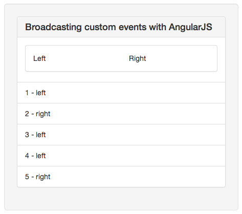

!SLIDE
# Events #

!SLIDE
## Broadcasting events downwards ##

!SLIDE code
cd events_broadcast

!SLIDE smaller
    @@@html
    <body ng-app='MyApp'>
      

        <form ng-submit='addItem()'>
          <input type='text' ng-model='item'>

          <button>
            Create
          </button>
        </form>
      

      <ul ng-controller='IndexController'>
        <li ng-repeat='item in items'>
          {{item}}
        </li>
      </ul>
    

  </body>

!SLIDE smaller
    @@@javascript
    var app = angular.module("MyApp", []);

    app.controller('NewController', function($scope, $rootScope){
      $scope.item = '';

      $scope.addItem = function(){
        $rootScope.$broadcast('item:add', $scope.item);
        $scope.item = '';
      };
    });

!SLIDE smaller
    @@@javascript
    app.controller('IndexController', function($scope){
      $scope.items = [];

      $scope.$on('item:add', function(event, item){
        $scope.items.unshift(item);
      });
    });

!SLIDE center

!SLIDE
## $broadcast(name, args) ##
Dispatches an event name downwards to all child scopes (and their children) notifying the registered listeners.

The event cannot be canceled.

!SLIDE
## Emit events upwards ##

!SLIDE code
cd events_emit

!SLIDE smaller
    @@@html
    

      

        

          

            Left
          

          

            Right
          

        

      

      <ul>
        <li ng-repeat='event in events'>
          {{$index + 1}} - {{event}}
        </li>
      </ul>
    

!SLIDE smaller
    @@@javascript
    var app = angular.module("MyApp", []);

    app.controller('DashboardCtrl', function($scope){
      $scope.events = [];

      $scope.$on('activity:click', function(event, activity){
        $scope.events.push(activity);
      });
    });

    app.controller('ActivityCtrl', function($scope){
      $scope.emit_event = function(activity){
        $scope.$emit('activity:click', activity);
      };

      $scope.left = function(){
        $scope.emit_event('left');
      };

      $scope.right = function(){
        $scope.emit_event('right');
      };
    });

!SLIDE center

!SLIDE
## $emit ##
Dispatches an event name upwards through the scope hierarchy notifying the registered listeners.

The event can be cancelled.

!SLIDE smbullets smaller
# Exercise #
* Create two controllers
* Transfer a rabbit from one to the other using events
* Visually indicate which controller the rabbit is in
* either $broadcast or $emit the rabbit
