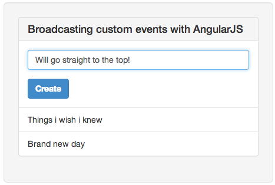

!SLIDE
# Events #

!SLIDE
## Communicating between controllers ##

!SLIDE smaller
    @@@html
    <body ng-app='MyApp'>
      

        <form ng-submit='addItem()'>
          <input type='text' ng-model='item'>

          <button>
            Create
          </button>
        </form>
      

      <ul ng-controller='IndexController'>
        <li ng-repeat='item in items'>
          {{item}}
        </li>
      </ul>
    

  </body>

!SLIDE smaller
    @@@javascript
    var app = angular.module("MyApp", []);

    app.controller('NewController', function($scope, $rootScope){
      $scope.item = '';

      $scope.addItem = function(){
        $rootScope.$broadcast('item:add', $scope.item);
        $scope.item = '';
      };
    });

!SLIDE smaller
    @@@javascript
    app.controller('IndexController', function($scope){
      $scope.items = [];

      $scope.$on('item:add', function(event, item){
        $scope.items.unshift(item);
      });
    });

!SLIDE center
