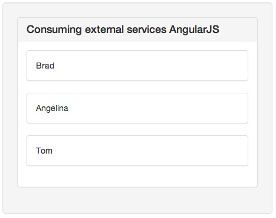
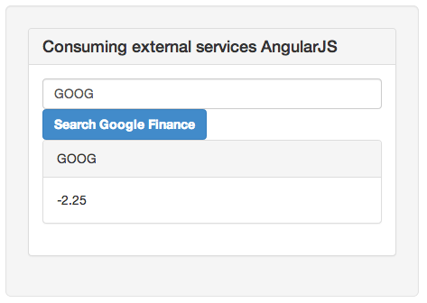

!SLIDE
# External services #

!SLIDE
## Consuming JSON ##

!SLIDE code
git checkout services_json

!SLIDE smaller
    @@@ javascript
    function MyController($scope, $http){
      $http.get('json/people.json').
      success(function(data, status, headers, config){
       $scope.people = data;
      }).
      error(function(data, status, headers, config){
        console.error('Could not load people')
      });
    };

!SLIDE smaller
    @@@ html
    <body ng-app ng-controller='MyController'>
      

        {{person.firstName}}
      

    </body>

!SLIDE center

!SLIDE
## Consuming JSONP ##

!SLIDE smaller
    @@@ html
    <body ng-app="MyApp">
      

        <input type='text' ng-model='searchTerm'>

        <button ng-click='search()'>
          Search Google Finance
        </button>

        

          
{{searchTerm}}

          {{result.c}}
        

      

    </body>

!SLIDE smaller
    @@@javascript
    var app = angular.module("MyApp", ["ngResource"]);

    app.controller("MyController", function($scope, $resource){
      $scope.searchTerm    = 'GOOG'

      $scope.googleFinance = $resource(
        'https://finance.google.com/finance/info',
        {client:'ig', callback:'JSON_CALLBACK'},
        {get: {method:'JSONP', isArray: true}}
      );

      $scope.search = function() {
        $scope.searchResults = $scope.googleFinance.get(
          { q: $scope.searchTerm }
        );
      };
    });

!SLIDE center
