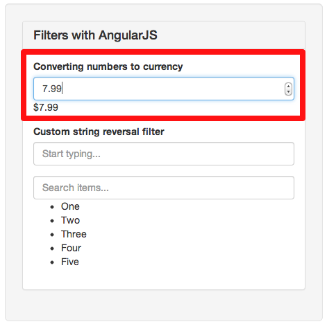
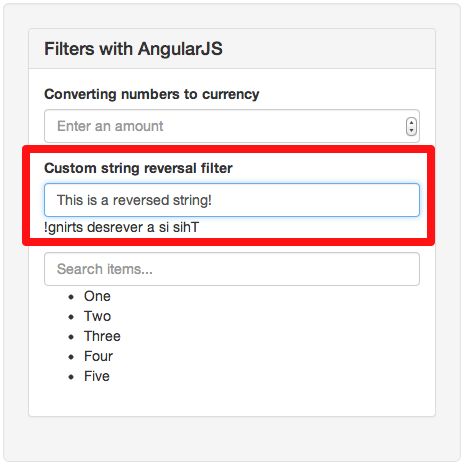
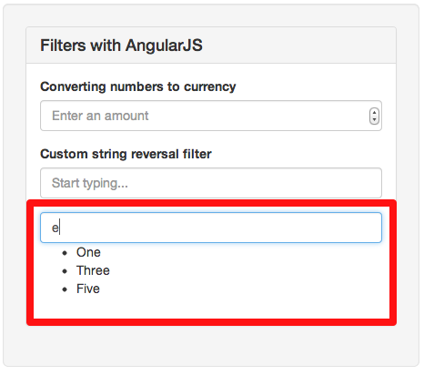

!SLIDE
# Filters #
Transform or reduce input

!SLIDE code
cd filters_basics

!SLIDE smaller
# Transforming input #
    @@@ html
    <input type="number" ng-model="amount">
    {{amount | currency}}

!SLIDE center

!SLIDE smaller
# Implementing a custom filter
    @@@ html
    <input type="text" ng-model="text">
    {{text | reverse}}

!SLIDE smaller
    @@@ javascript
    var app = angular.module("MyApp", []);

    app.filter('reverse', function() {
      return function(text){
        text = text || "";
        return text.split('').reverse().join('');
      };
    });

!SLIDE center

!SLIDE smaller
# Reducing elements of array #

!SLIDE smaller
    @@@javascript
    var app = angular.module("MyApp", []);

    app.controller('MyController', function($scope){
      $scope.entries = [
        {text: 'One'},
        {text: 'Two'},
        {text: 'Three'},
        {text: 'Four'},
        {text: 'Five'}
      ]
    });

!SLIDE smaller
    @@@html
    <input type='text' ng:model='search'>
    <ul>
      <li ng:repeat='entry in entries | filter:search'>
        {{entry.name}}
      </li>
    </ul>

!SLIDE center
